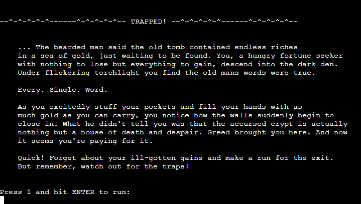
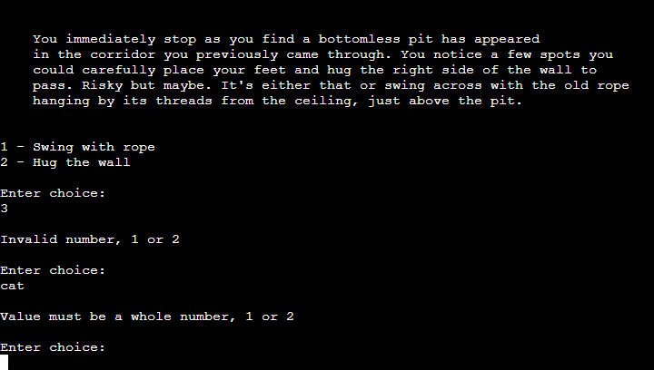
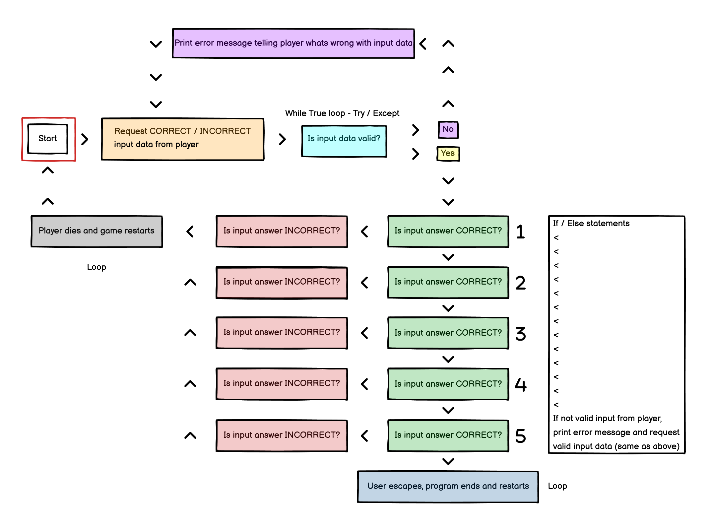
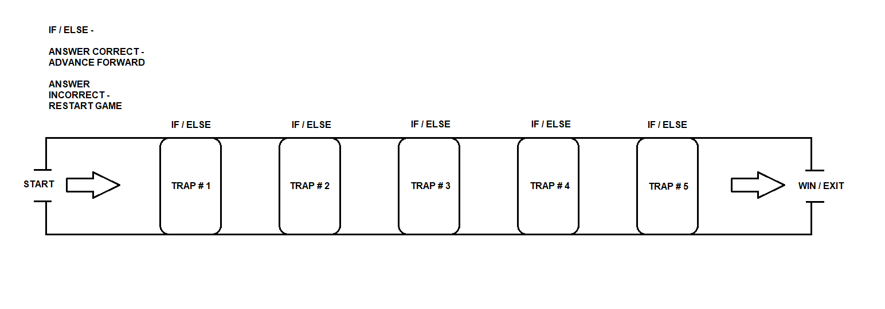

# Trapped! 

Trapped! is an old school text-based adventure game written in Python. It runs in the Code Institute mock terminal on Heroku. 

The user experiences a narrative game, in which they can make a choice in how to advance forward. 

The live link can be found here: [Trapped!](https://trapped.herokuapp.com/)

 

## How to play

Trapped! is an old school text-based adventure game. The player is presented with a narrative scene and is promted with options to choose from in order to advance the story forward. Trapped! being a deadly game, the player has to choose the correct answer in each scene. An incorrect answer will cause game over and restart. 

 

## Features

 

### Existing features 

- Narrative gameplay advanced circularly

- Play along the computers story
- Accepts user input
- Input validation and error-checking
    - You must enter whole numbers, 1 or 2

 

### Features Left to Implement

- In its current state, the game is fully playable and an adrenaline-filled experience but as with most things, there is always room for improvement. In the future I would like to add:
    - More player choice options, opening the game to more possible outcomes
    - Branching choice options, leading to a deeper experience
    - Randomized narrative scenes, unbound from previous scene

 

## Planning stage

I used Balsamiq Wireframes to build a wireframe to first plan my project. Using the wireframe tool allowed me to get a clear understanding of what I was going to build and where parts needed to be placed. 

 

## Testing

- I have playtested the game in browsers: Chrome, Firefox, Edge
    - Working as intended
- As the validator website [pep8online.com](http://ww7.pep8online.com/) is currently down, I have manually run a Python linter in my workspace as per Code Institute's instructions
    - No errors found
- I have run the code through Code Institute's [Python Linter](https://pep8ci.herokuapp.com/)
    - All clear, no errors found

 

## Deployment 
This project was deployed unsin Code Institute's mock terminal in Heroku
- Steps for deployment
    - Fork or clone this repository
    - Create a new Heroku app
    - Set the buildbacks to Python and NodeJS in that order
    - Link the Heroku app to the repository
    - Click on Deploy

## Credits 

### Content 
- The content of these three websites helped me better understand how to write certain parts of the code. I altered the code to fit my project. 
    - [Website 1](https://www.askpython.com/python/text-based-adventure-game)
    - [Website 2](https://python.plainenglish.io/building-an-old-school-text-based-game-with-python-efcc33d25a42)
    - [Website 3](https://www.derekshidler.com/how-to-create-a-text-based-adventure-and-quiz-game-in-python/)
- This [website](https://realpython.com/python-time-module/) helped me gain an understanding on how to use the Time module. 

Code Institute for the deployment termnial